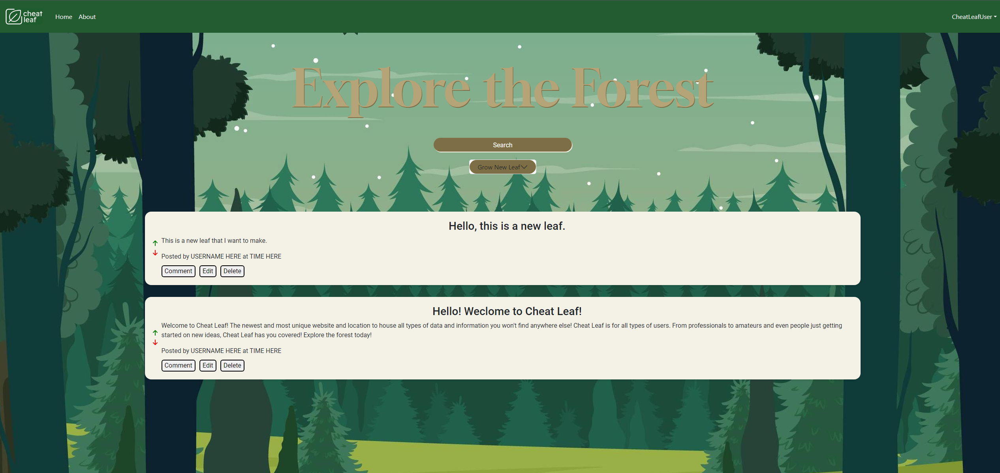

# Cheat Leaf
## Description

Check out the deployed application here! ---> https://cheat-leaf.herokuapp.com/

A clean, well-designed cheat-sheet, web platform that hosts data related to code blocks and other information. It’s an all-around good resource for finding unique data sets to help you get ahead.

Imagine this: You're a student sitting in a crowded lecture hall, surrounded by the soft murmur of fellow students frantically scribbling notes. The professor's voice drones on and on, drowning out any hope of comprehending the subject matter. Frustrated and feeling like you're drowning in a sea of information, you turn to your phone and open up your favorite app. Suddenly, you find yourself in a lush digital forest, a community where ideas grow and thrive.

Welcome to “Cheat Leaf" - a place where users create cheat sheets, known as "cheat leaves," to share with others. In this forest, you are not just a user, but a "tree" with branches of knowledge extending in all directions. You can organize your cheat leaves in different branches, connecting with other like-minded individuals who share your passions and interests.

As you explore this enchanted forest, you realize that you are not alone. The trees around you are full of life, buzzing with conversations about everything from calculus to coding. You feel energized, your mind racing with new ideas and possibilities.

And it's not just about cheating your way through exams - this forest is a place to learn, to grow, and to challenge yourself. You can discover new concepts and share your own knowledge with others. The forest is a community, one that thrives on collaboration and cooperation.
So, come and join us in the Forest of Ideas. It’s the kind of place that grows on you. 

Users create “cheat leafs” they can share with others. They can organize their “cheat leafs” in “branches”. And they themselves are considered “trees.” All together, users come together into a community known as a “forest of ideas.” It’s the kind of place that grows on you.

# Preview

## Table of Contents
- [Features](#features)
- [Usage](#usage)
- [About](#about)
- [Credits](#credits)
- [License](#license)
- [Questions](#questions)

## Features

Cheat Leaf is a cool hub for posting and hosting all of your various data and utilities to get your work done faster! Need some help figuring out some code? Search our Cheat Leaf forest of information for the leaf that helps you the most!

## Usage

Our forest is open to everyone who wants to share their ideas and connect with like-minded individuals. Whether you're a student, a professional, an entrepreneur, or just someone who wants to express themselves, our website welcomes you.

## About

Why choose Cheat Leaf?

Our website offers a user-friendly interface that makes it easy to create and publish your content. We also provide a range of tools and resources to help you optimize your content for search engines, and find what you need fast! Some information on Cheat Leaf might not be found anywhere else. This is what makes Cheat Leaf unique!

## Credits
- Michael Virga ([studiomav](https://github.com/studiomav))
- Dominic Paulazzo ([wevexOP](https://github.com/wevexOP))
- Troy Miller ([R0x0s](https://github.com/R0x0s))
- James Inanoria ([jxmesin](https://github.com/jxmesin))
- Kait Heinle ([kait-kat](https://github.com/kait-kat))
- Christian Areas ([christianareas](https://github.com/christianareas))

## License
See [LICENSE (GNU GPLv3)](./LICENSE).

## Questions
Reach out with questions:

- GitHub: [github.com/areas-boot-camp-projects](https://github.com/areas-boot-camp-projects)
- Email: [cheat-leaf@berkeley.edu](#)
